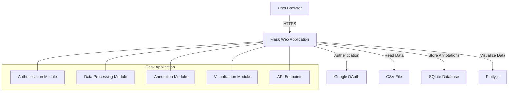
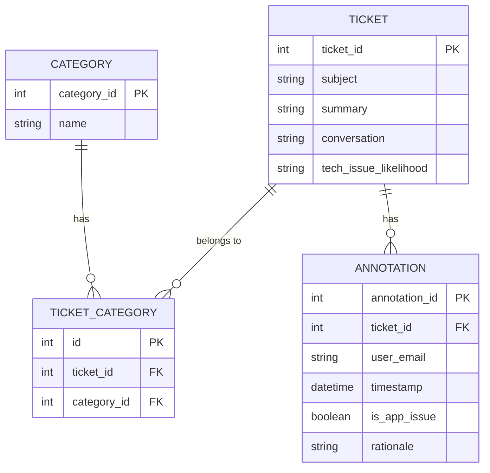
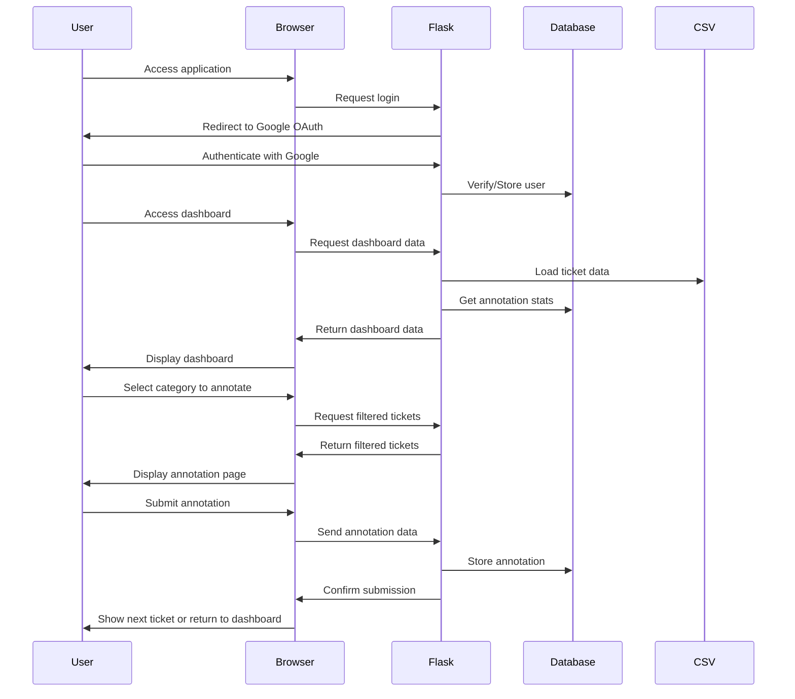

# Detailed Plan: Customer Support Ticket Annotation Tool

## 1. System Architecture



## 2. Database Schema



## 3. Project Structure

```
annotation_tool/
├── app/
│   ├── __init__.py
│   ├── auth/
│   │   ├── __init__.py
│   │   └── routes.py
│   ├── main/
│   │   ├── __init__.py
│   │   └── routes.py
│   ├── models/
│   │   ├── __init__.py
│   │   └── models.py
│   ├── static/
│   │   ├── css/
│   │   │   └── tailwind.css
│   │   ├── js/
│   │   │   └── charts.js
│   │   └── img/
│   └── templates/
│       ├── base.html
│       ├── auth/
│       │   ├── login.html
│       │   └── logout.html
│       └── main/
│           ├── dashboard.html
│           └── annotation.html
├── config.py
├── data/
│   └── tickets.csv
├── instance/
│   └── app.db
├── migrations/
├── requirements.txt
├── run.py
└── README.md
```

## 4. Implementation Plan

### 4.1 Setup and Configuration (Week 1)

1. **Environment Setup**
   - Create a virtual environment
   - Install required packages (Flask, pandas, SQLAlchemy, Flask-Login, etc.)
   - Set up project structure

2. **Google OAuth Configuration**
   - Create a Google Cloud Project
   - Configure OAuth consent screen
   - Create OAuth client ID
   - Set up redirect URIs
   - Implement authentication flow in Flask

3. **Database Setup**
   - Define SQLAlchemy models
   - Set up database migrations
   - Create initial database schema

### 4.2 Data Processing (Week 1)

1. **CSV Import**
   - Create functions to load and process CSV data
   - Map CSV data to database models
   - Handle data validation and cleaning

2. **Category Management**
   - Implement functions to manage ticket categories
   - Create relationships between tickets and categories

### 4.3 Backend Development (Week 2)

1. **API Endpoints**
   - Create RESTful API endpoints for:
     - Authentication
     - Ticket retrieval
     - Annotation submission
     - Dashboard data

2. **Business Logic**
   - Implement ticket filtering by category and status
   - Create logic for tracking annotations
   - Implement user access control

### 4.4 Frontend Development (Week 2-3)

1. **UI Framework**
   - Set up Tailwind CSS
   - Create base templates and layouts

2. **Dashboard Page**
   - Implement summary table with:
     - Categories
     - Unlabelled ticket counts
     - Positive/negative classification counts
   - Add filtering by date and category
   - Create links to annotation page with filters

3. **Annotation Page**
   - Display ticket details (ID, subject, summary, conversation)
   - Show current position and total count
   - Implement yes/no verdict buttons
   - Add rationale text field
   - Create navigation controls (back, skip)

4. **Data Visualization**
   - Implement Plotly.js charts
   - Create line chart with daily granularity
   - Add interactive filtering

### 4.5 Testing and Deployment (Week 3)

1. **Testing**
   - Write unit tests for backend functionality
   - Perform integration testing
   - Conduct user acceptance testing

2. **Deployment**
   - Set up production environment
   - Configure database for production
   - Deploy application

## 5. Detailed Technical Specifications

### 5.1 Backend (Flask)

#### Authentication Module
- Implement Google OAuth 2.0 authentication
- Restrict access to company domain emails
- Create session management with Flask-Login

#### Data Processing Module
- Use pandas for CSV processing
- Implement data validation and cleaning
- Create functions for filtering and querying data

#### Annotation Module
- Store annotations with user information and timestamps
- Track annotation history
- Implement logic to use the latest annotation

#### API Endpoints
- `/auth/login` - Google OAuth login
- `/auth/logout` - Logout endpoint
- `/api/tickets` - Get tickets with filtering
- `/api/tickets/<id>` - Get specific ticket
- `/api/annotate` - Submit annotation
- `/api/dashboard` - Get dashboard data

### 5.2 Frontend

#### Dashboard Page
- Responsive table with category statistics
- Date range picker for filtering
- Category dropdown for filtering
- Line chart with daily issues by category
- Links to annotation page with pre-filtered data

#### Annotation Page
- Ticket details display
- Progress indicator (e.g., "Ticket 5 of 27")
- Yes/No verdict buttons
- Optional rationale text field
- Navigation controls (back to dashboard, skip, next)

### 5.3 Database

#### Tables
- `tickets` - Store ticket information
- `categories` - Store category information
- `ticket_categories` - Many-to-many relationship
- `annotations` - Store annotation results
- `users` - Store authenticated user information

## 6. Google OAuth Setup Steps

1. **Create a Google Cloud Project**
   - Go to the [Google Cloud Console](https://console.cloud.google.com/)
   - Create a new project
   - Note the Project ID

2. **Configure OAuth Consent Screen**
   - Go to "APIs & Services" > "OAuth consent screen"
   - Select "Internal" for access type (restricts to your organization)
   - Fill in application name, support email, and developer contact information
   - Add necessary scopes (email, profile)
   - Save and continue

3. **Create OAuth Client ID**
   - Go to "APIs & Services" > "Credentials"
   - Click "Create Credentials" > "OAuth client ID"
   - Select "Web application" as application type
   - Add authorized JavaScript origins (e.g., `http://localhost:5000`)
   - Add authorized redirect URIs (e.g., `http://localhost:5000/auth/callback`)
   - Click "Create"
   - Save the Client ID and Client Secret

4. **Implement in Flask Application**
   - Store Client ID and Client Secret in environment variables
   - Use Flask-Dance or Authlib to implement OAuth flow
   - Verify user's email domain during authentication

## 7. Data Flow



## 8. Risks and Mitigations

| Risk | Impact | Mitigation |
|------|--------|------------|
| Large CSV files causing memory issues | High | Implement chunked processing, pagination |
| Google OAuth configuration complexity | Medium | Provide detailed setup documentation |
| Multiple annotations for same ticket | Low | Ensure database design tracks history and uses latest |
| Performance issues with many tickets | Medium | Implement efficient querying and caching |
| Data visualization performance | Medium | Use efficient charting library, implement data aggregation |

## 9. Future Enhancements

1. **Batch Annotation**
   - Allow annotating multiple tickets at once

2. **Export Functionality**
   - Export annotations to CSV/Excel

3. **Advanced Analytics**
   - Add more visualization types
   - Implement annotation trend analysis

4. **User Management**
   - Add admin roles
   - Create user performance metrics

5. **API Expansion**
   - Create public API for integration with other systems